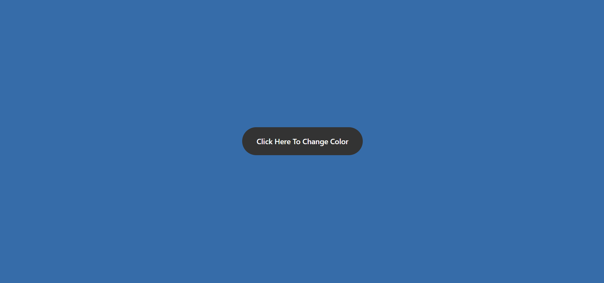

# Color Changer

## Description

A JavaScript DOM project in which the background color of a web page changes whenever a button is clicked or an Enter key is pressed. This project is created using HTML, CSS, and Javascript.

## Learnings from this project -

- How `getElementsByTagName` API can be used to access HTML elements
- How to generate random values within a specific range using `Math.random()`
- What are `event listeners` and how they can be added to HTML elements

### Preview of the project

### [Live link](https://color-changer-xi-five.vercel.app/) of the project.
